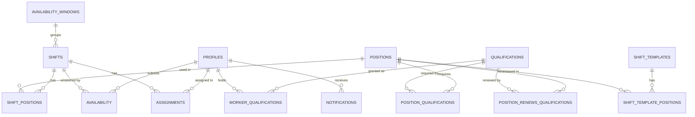
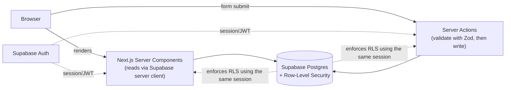

# תכנון ארכיטקטורת התוכנה (Draft v1) — Squadron Personnel & Shift Scheduling App

> Builds on `docs/product-spec.md` and the decisions recorded in `CLAUDE.md`. This is a
> high-level system design (course deliverable #3) — folder structure, exact API signatures, and
> UI-level detail belong in the detailed technical plan doc (deliverable #4), not here.

## אילו רכיבים יהיו במערכת (System components)

- **Next.js app (TypeScript)** — a single App Router application serving both the Admin and
  Worker experiences. No separate frontend/backend codebase or repo — Next.js Server Components
  and Server Actions *are* the backend.
- **Supabase Postgres** — the database.
- **Supabase Auth** — authentication (session/JWT issuance), used by both the Next.js server
  (via `@supabase/ssr`) and enforced again at the database layer via Row-Level Security.
- **Vercel** — hosts and deploys the Next.js app.

There is no separate REST/GraphQL API service and no background job runner. Both are
deliberately avoided — see "Server actions vs. API routes" and "Qualification expiry" below for
why, and why that's a reasonable choice at this project's scale (see also the future scale doc).

## האם תשתמשו במסד נתונים (Database)

Yes — Supabase Postgres. A relational database fits this domain well: qualifications, positions,
shifts, and assignments are all entities with clear relationships to each other (a shift needs
positions; a position requires qualifications; a worker holds qualifications) — exactly what a
relational schema with foreign keys is for, as opposed to a document store.

## אילו טבלאות/ישויות מרכזיות יהיו במסד הנתונים (Core entities)

| Table | Purpose | Key fields |
|---|---|---|
| `profiles` | One row per user (extends Supabase `auth.users`) | `id`, `full_name`, `role` (`admin` \| `worker`) |
| `qualifications` | Admin-defined qualification types | `id`, `name`, `renewal_interval_days` (nullable — null = never expires) |
| `positions` | Admin-defined position types | `id`, `name` |
| `position_qualifications` | Which qualifications a position requires | `position_id`, `qualification_id` |
| `position_renews_qualifications` | Which qualification(s) fulfilling a position renews | `position_id`, `qualification_id` |
| `worker_qualifications` | Which qualifications a worker holds | `id`, `worker_id`, `qualification_id`, `source` (`self_reported` \| `admin_granted`), `status` (`pending` \| `approved` \| `rejected`), `obtained_at`, `reviewed_by`, `reviewed_at` |
| `shift_templates` | Reusable named bundles of position requirements | `id`, `name` |
| `shift_template_positions` | Positions + headcount for a template | `template_id`, `position_id`, `headcount_needed` |
| `availability_windows` | A period during which workers submit availability | `id`, `label`, `opens_at`, `closes_at` |
| `shifts` | A concrete shift/duty | `id`, `date`, `start_time`, `end_time`, `location`, `availability_window_id` (nullable FK), `published_at` (nullable) |
| `shift_positions` | Positions + headcount needed for a specific shift | `id`, `shift_id`, `position_id`, `headcount_needed` |
| `availability` | A worker's response for one shift | `id`, `worker_id`, `shift_id`, `is_available`, `responded_at` |
| `assignments` | Worker assigned to a position on a shift | `shift_id` + `position_id` (composite FK → `shift_positions`), `worker_id`, `created_by` (nullable — null = engine, set = admin), `created_at` |
| `notifications` | In-app notifications for workers | `id`, `worker_id`, `shift_id` (nullable), `message`, `created_at`, `read_at` (nullable) |
| `scheduling_constraints` | Admin-tunable parameters for the scheduling heuristic (e.g. minimum rest between shifts) | `id`, `type`, `enabled`, `value` |

**Refinements from the earlier planning notes in `TODO.md`, made concrete here:**
- `position_renews_qualifications` is its own join table (position → *many* qualifications it can
  renew), mirroring `position_qualifications` exactly — a position can renew more than one
  qualification at once (e.g. a duty that counts toward both a first-aid cert and a general
  fitness requirement). This is a strict generalization of "renews one qualification," so it
  costs nothing to support and never needs revisiting even if, in practice, most positions end up
  renewing just one.
- **A worker's qualification expiry is *computed*, not stored.** There's no `expires_at` column
  on `worker_qualifications`. Instead, expiry is derived at query time as:
  `latest(obtained_at, all completed shifts where this worker filled a position that renews this
  qualification) + qualification.renewal_interval_days`. "Completed" means `shift.date` has
  passed (see the completion assumption in `product-spec.md`). This avoids needing a background
  job or cron trigger to keep a stored value in sync — there's no moment where a write needs to
  happen "because time passed"; the value is just computed whenever it's read (e.g. as a SQL view
  or a query function). At this project's scale (dozens–hundreds of rows), this is simple and
  fast; it's exactly the kind of thing to revisit if this ever needed to scale much further.
- `assignments` has no separate `status` field. Whether an assignment is "proposed" or "final" is
  derived from its shift's `published_at`: `NULL` → still under admin review (workers must not
  see it); set → published and visible to the assigned worker. One `publish` action sets
  `published_at` on every shift in an availability window at once and creates the corresponding
  `notifications` rows.

### Entity relationships

## אילו עמודים יהיו באפליקציה (Pages)

Shared:
- `/login` — passwordless sign-in (magic link / email OTP via Supabase Auth; see "External
  libraries" for why passwordless over password-based).
- `/accept-invite` — completes account setup after an admin invites a worker.
- `/dashboard` — a single route, **role-aware**: renders the admin dashboard or the worker
  dashboard depending on `profiles.role`. One mental model of "home" rather than two disconnected
  routes.

Admin-only (`role = admin`, enforced by RLS + a layout-level guard):
- `/admin/qualifications` — CRUD qualifications (name, renewal interval).
- `/admin/positions` — CRUD position types; set required qualifications and which
  qualification(s), if any, the position renews when fulfilled.
- `/admin/personnel` — list of workers; a detail view per worker shows their qualifications and
  lets the admin approve/reject pending self-reports or grant/revoke qualifications directly.
- `/admin/shift-templates` — CRUD shift templates.
- `/admin/shifts` — create/edit/delete shifts (optionally starting from a template), grouped by
  availability window.
- `/admin/availability-windows/[id]` — open/close an availability window; see submitted
  availability per shift.
- `/admin/schedule/[windowId]` — trigger schedule generation for the window, review/edit the
  proposed assignments, resolve flagged understaffed shifts, publish.
- `/admin/scheduling-settings` — enable/tune the scheduling heuristic's constraint parameters
  (e.g. minimum rest between shifts, max shifts per worker per window).

Worker-only (`role = worker`):
- `/my-qualifications` — view own qualifications with computed expiry status; self-report a new
  one (goes in as `pending`).
- `/availability` — respond to shifts in the currently open availability window.
- `/my-shifts` — published shifts the worker is assigned to.

## Server actions vs. API routes

**Decision: Next.js Server Actions for essentially all mutations; no separate REST API layer.**
This app has exactly one client (its own frontend) — there's no mobile app, external partner, or
public API to serve, so a conventional REST/API-route layer would just be indirection with no
consumer. Server Actions run with the requesting user's Supabase session, so Row-Level Security
applies exactly as if the call came from the browser directly. Route Handlers (API routes) would
only be introduced later if something *not* triggered by a user interaction needs an HTTP
endpoint (e.g. a webhook) — nothing in this design currently needs one.

Representative server actions (one module per domain, per the organization principle in
`CLAUDE.md` — not an exhaustive list):
- `qualifications.ts`: `createQualification`, `updateQualification`, `deleteQualification`
- `positions.ts`: `createPosition`, `updatePosition`, `setPositionRequirements`
- `workerQualifications.ts`: `selfReportQualification`, `reviewQualification` (approve/reject),
  `grantQualification`, `revokeQualification`
- `shiftTemplates.ts`: `createTemplate`, `updateTemplate`, `deleteTemplate`
- `shifts.ts`: `createShift` (optionally `fromTemplateId`), `updateShift`, `deleteShift`
- `availability.ts`: `submitAvailability`
- `schedule.ts`: `generateSchedule` (runs the heuristic, writes `assignments`), `updateAssignment`
  (manual admin reassignment), `publishSchedule` (sets `published_at`, writes `notifications`)

## איך המידע יזרום בין ה-Frontend, ה-Backend וה-Database (Data flow)

- **Reads**: Server Components fetch data directly from Supabase using the signed-in user's
  session (via `@supabase/ssr` cookies) — so a query only ever returns what RLS allows for that
  user, without the page needing to re-implement that filtering itself.
- **Writes**: forms call Server Actions, which validate input with Zod, then write to Supabase
  using the same session — RLS is the final authorization check even if a UI-level check were
  ever missed (defense in depth, not the only check — Server Actions also re-check role before
  performing admin-only writes).
- **No client-side Supabase calls with elevated privileges** — nothing uses the Supabase service
  role key from the browser; only Server Components/Actions run with the service context needed
  for anything beyond a normal user session (and only where actually necessary, e.g. sending
  invites).

## אילו משתמשים והרשאות יהיו במערכת (Users & permissions)

Two roles, no multi-organization layer (see `CLAUDE.md`):

| Resource | Admin | Worker |
|---|---|---|
| Qualifications, positions, shift templates | full CRUD | read-only |
| Shifts, availability windows | full CRUD | read-only (own relevant shifts) |
| Own profile & own `worker_qualifications` | full (as admin over everyone) | read own; can insert a `pending` self-report for own |
| Approving/granting qualifications | yes | no |
| Availability responses | read all | read/write only their own |
| Assignments **before** publish (`published_at IS NULL`) | read/write | **no access** — must not see a proposed schedule before it's finalized |
| Assignments **after** publish | read all | read only their own |
| Notifications | — | read only their own |

Enforced in two layers:
1. **Row-Level Security policies** in Postgres — the actual authorization boundary; a compromised
   or buggy UI still can't read/write data the policy forbids.
2. **Server Action-level role checks** — a defense-in-depth check before performing admin-only
   writes, so a mistake shows up as an explicit rejected action rather than relying solely on the
   database silently returning zero rows.

The "worker can't see unpublished assignments" rule is the one authorization rule in this system
that's about *timing*, not just role — worth calling out explicitly since it's easy to miss when
writing the RLS policy (a naive "workers can read assignments where `worker_id = auth.uid()`"
policy would leak the draft schedule early).

## אילו ספריות או שירותים חיצוניים תשלבו, ולמה (External libraries & services)

| Library/service | Why |
|---|---|
| **Supabase** (`@supabase/supabase-js`, `@supabase/ssr`) | Required by the assignment; provides Postgres + Auth + RLS in one service. |
| **Vercel** | Required by the assignment for deployment. |
| **Tailwind CSS + shadcn/ui** | Component code is generated into the repo rather than pulled in as an opaque dependency — fits the requirement to understand and explain every piece of the codebase, while still being much faster than building accessible components from scratch. Tailwind's mobile-first responsive utilities and shadcn/ui's responsive-by-default components are also why responsive layout is built in from day one rather than retrofitted later (see "Responsive design" below). |
| **Zod** | Input validation for every Server Action — a clear, explainable answer to the assignment's "input validation" requirement, and it pairs naturally with TypeScript types. |
| **date-fns** | Date/interval arithmetic for qualification expiry and renewal-window calculations — avoids hand-rolled date math bugs. |
| **Supabase Auth's built-in invite-by-email** | Used for the admin's worker-invite flow — avoids adding a separate transactional email provider as a dependency. |

Deliberately **not** used: a background job/cron service (qualification expiry is computed at
read time, not written by a scheduled job — see above), a separate email/SMS provider (in-app
notifications only for v1, per `product-spec.md`), a constraint-solver library (the matching
engine is a hand-written heuristic, intentionally, so it stays explainable).

## Responsive design

Built in from the start on every page, not treated as a separate mobile version or deferred
work — Tailwind's mobile-first utilities and shadcn/ui's responsive-by-default components make
this close to free, and retrofitting it later would mean reworking already-built layouts instead.

- **Worker-facing pages** (`/my-shifts`, `/availability`, `/my-qualifications`, worker dashboard)
  are **mobile-first**: a worker checking their upcoming shift or submitting availability is a
  classic "quick check on a phone" interaction.
- **Admin pages**, especially the schedule review/edit screen, stay fully responsive but are
  **desktop-optimized**: reviewing a grid of shifts × positions × workers is inherently
  information-dense and genuinely more usable on a larger screen. This is a normal, deliberate
  trade-off for admin tooling, not a shortcut — the pages still work on mobile, they're just not
  designed mobile-first.

---

## Open items for the detailed technical plan (next doc)

- Exact RLS policy SQL per table.
- Exact shape of the scheduling heuristic (the matching algorithm's step-by-step logic).
- Folder structure and component breakdown.
- Error handling and validation conventions (e.g., how Server Action errors surface to the UI).
